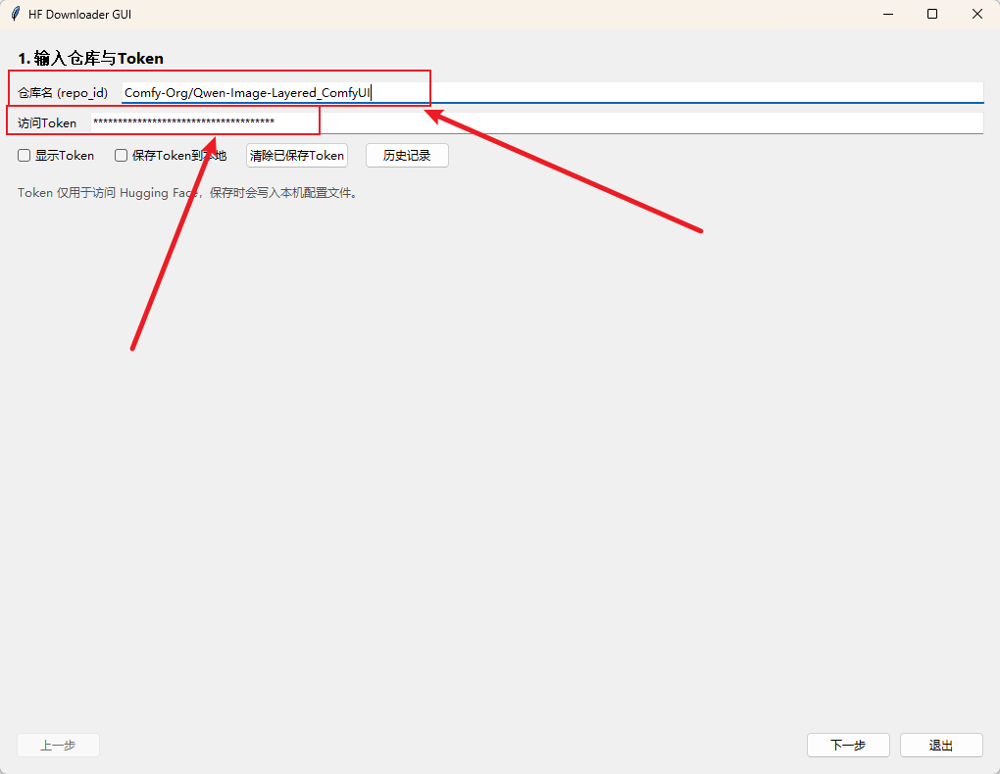
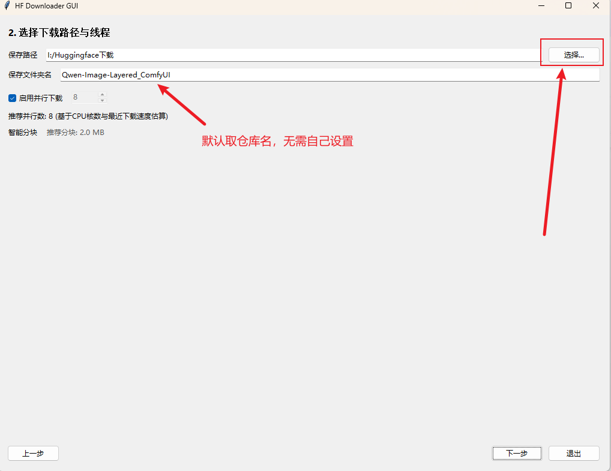
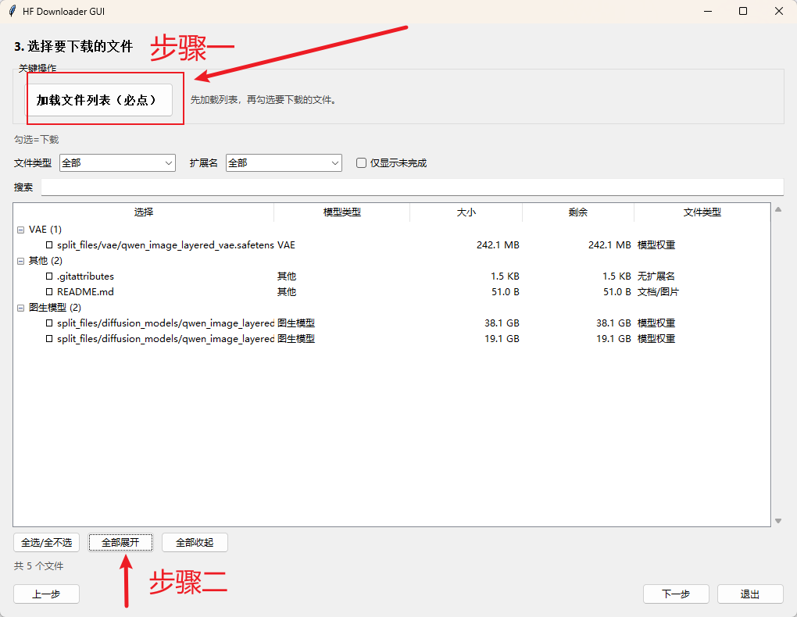
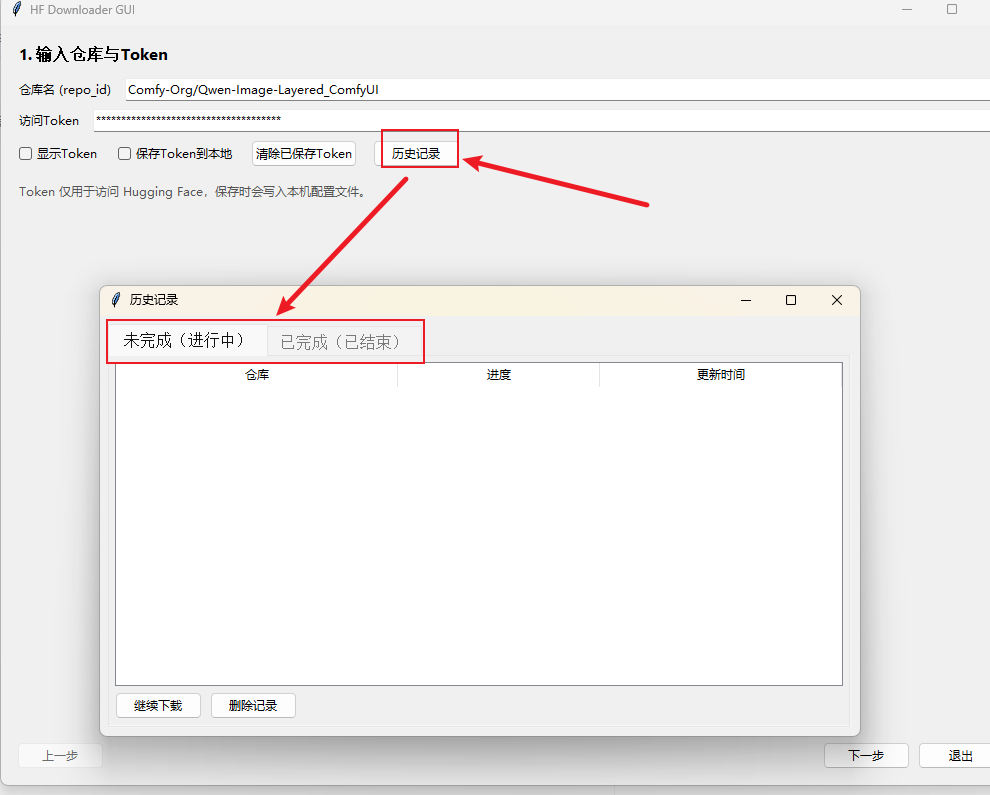

# HF Model Downloader (Windows)


一个专注于 Hugging Face 模型下载的 Windows 桌面工具：可选文件、分组分类、显示进度与速度，支持断点续传与历史记录。

## 亮点
- 直连下载：支持断点续传与未完成续下
- 文件清单：分类分组、搜索过滤、仅看未完成
- 下载体验：整体 + 单文件进度、速度显示、智能并行与分块
- 历史记录：已完成 / 未完成分离，可续传与删除
- 隐私安全：打包不包含本机 Token / 历史记录

## 使用流程






## 下载方式
### 方式 A：直接下载解压包（推荐）
1. 打开 Releases 下载： https://github.com/Yifo98/HF_Model_Downloader/releases
2. 解压 `HF_Model_Downloader.zip`
3. 双击 `HF_Model_Downloader.exe` 直接运行

说明：使用解压包不需要安装 Python 或创建 venv。

### 镜像节点与测试（可选）
如果网络不稳定或 VPN 流量有限，可在“下载来源”中选择镜像或自定义镜像地址（需以 `https://` 开头）。支持“测试连接”验证可用性。官方直连不在镜像列表内。私有模型仍需要 Token。


### 方式 B：使用源码运行
1. 运行 `1.安装依赖.bat`（会创建 `.venv`）
2. 运行 `2.一键启动.bat`

## 功能清单
- 输入仓库名与 Token
- 选择保存路径与文件夹名
- 线程数推荐与可选设置
- 文件列表加载、类型过滤、分类与搜索
- 显示文件大小与模型类型（文生图 / 文生视频 / 图生图 / LoRA 等）
- 按模型大类分组并显示数量，可展开 / 收起
- 勾选即代表下载目标，支持全选 / 全不选
- 支持单个 / 多个文件下载
- 下载进度：整体 + 单文件进度条
- 显示未完成下载清单与剩余大小
- 同步显示下载速度
- 支持多文件并行下载并给出推荐并行数
- 支持智能分块并显示推荐分块大小
- “加载文件列表”和“开始下载”已做高亮提示
- 支持暂停与恢复下载
- 历史记录可查看已完成 / 未完成任务，并支持继续下载
- 删除记录时可将本地文件夹移动到回收站
- 退出会提示停止下载并结束占用
- 下载来源可选官方或镜像，并支持镜像连通性测试

## 打包
```powershell
3.一键打包.bat
```
输出：`HF_Model_Downloader.zip`

说明：打包过程不会包含本机 Token / 历史记录，也不会打包 `.venv`。

## 源码运行（可选）
### 安装依赖
```powershell
1.安装依赖.bat
```
会在当前目录创建 `.venv` 并安装依赖。

### 启动桌面版
```powershell
2.一键启动.bat
```

## 配置与数据位置
- Token 保存：`%APPDATA%\hf_downloader_gui\config.json`
- 默认下载路径会自动保存，下次启动自动填充

## 常见问题
### 解压后双击没有反应？
- 请确认系统未拦截下载文件（右键 -> 属性 -> 解除锁定）
- 若提示缺 DLL，安装微软 VC 运行库后重试

### 下载速度慢？
- 可在设置中调整并行数与分块大小
- 部分模型仓库本身限速，请耐心等待

### 删除失败（文件被占用）怎么办？
如果删除记录时提示“删除失败（可能被占用）”，可使用 IObit Unlocker 手动解锁并删除：  
下载地址：https://www.iobit.com/en/iobit-unlocker.php


