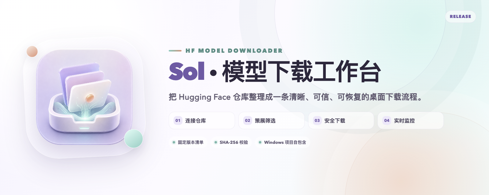

# HF Model Downloader 5.6 Sol

<p align="center">
  
</p>

HF Model Downloader 是一个面向 Hugging Face 模型仓库的 Electron 桌面工作台。5.6 Sol 将主流程重构为“连接、策展、下载、监控”四个阶段，并重新设计了下载身份、凭证、路径和桌面权限边界。

> 当前源码版本为 `5.6.3`。发布资产是未签名的便携版本；macOS 公证、Windows Authenticode 与双平台真机验收状态会在对应 Release 中明确标注。

## 下载便携版

- [前往 5.6.3 GitHub Release](https://github.com/Yifo98/HF_Model_Downloader/releases/tag/v5.6.3)
- macOS Apple Silicon：`HF-Model-Downloader-5.6.3-mac-arm64-portable.zip`
- Windows x64：`HF-Model-Downloader-5.6.3-windows-x64-portable.zip`；解压后运行根目录的 `Start HF Model Downloader.cmd`
- Electron 与运行依赖已完整打入便携包；普通用户不需要安装 Node.js、npm 或 Python
- 下载后使用同一 Release 的 `SHA256SUMS.txt` 核对文件完整性

完整变化与首次运行边界见 [5.6.3 Release Notes](docs/releases/5.6.3.md)。

## 核心能力

- 读取 `owner/repo` 的固定 commit 清单，而不是直接依赖可变的 `main`
- 文件清单按仓库目录折叠整理，可逐层展开、逐个选择文件或整组选中文件夹
- 按文件名、路径、用途族群和推荐方案选择下载内容
- 支持自动推荐、系统代理、直连和自定义代理，模型源与网络通道独立切换
- 默认选择运行所需文件，避免无意下载整个仓库
- 支持并发下载、断点续传、取消、历史恢复、失败重试和实时队列
- 下载历史可与本地文件刷新同步；删除时可明确选择“只删记录”或“记录与文件一起删除”
- LFS 文件校验 SHA-256，普通 Git 文件校验 blob OID
- Token 只在当前会话使用，只允许发往 Hugging Face 官方源
- 下载目录、文件定位、运行目录打开和外链都由主进程按白名单处理
- 内置 GitHub Release 检查更新，显示 Release Notes，并在下载后核验 SHA-256
- Windows 便携版把数据、下载、缓存、日志与临时目录统一收进解压项目根的 `HF_Model_Downloader_Data/`；macOS 使用用户目录下的独立运行区

## 使用方式

1. 填写 Hugging Face 仓库 ID，例如 `Comfy-Org/frame_interpolation`。
2. 选择官方源或内置 HF Mirror，再选择自动推荐、系统代理、直连或自定义代理。
3. 私有仓库如需 Token，只能搭配官方源使用。
4. 选择下载目录并读取文件清单。
5. 展开仓库目录，逐个选择文件、整组选中文件夹，或使用推荐方案与筛选。
6. 启动下载，在右侧监控队列、速度、校验结果和运行日志。

优先选择 `safetensors` 权重。下载与哈希校验成功只代表文件传输和内容身份正确，不代表模型代码天然可信。

## 本地开发

需要 Node.js 20+ 与 npm。

```bash
npm ci
npm run dev
```

常用检查：

```bash
npm test
npm run lint
npm run build
npm audit
```

只有发布任务才运行：

```bash
npm run dist:mac
npm run dist:win
npm run dist:portable
```

仓库根目录的 `Launch HF Model Downloader.command` 可在 macOS 上启动开发版。

## 数据与隐私

- macOS/Linux 默认下载目录：`~/Program/Downloads`
- 应用运行数据：`~/Program/HuggingFace/HF_Model_Downloader`
- Windows portable：程序旁的 `HF_Model_Downloader_Data/`
- Token 不写入偏好、历史、日志或渲染层下载状态
- 应用不上传下载历史、文件清单或本地路径，不包含遥测

更完整的边界与发布门槛见 [5.6 安全复核](docs/security/5.6-review.md)。

## 文档

- [文档索引](docs/INDEX.md)
- [5.6 Sol 运行架构](docs/architecture/5.6-sol.md)
- [5.6 安全复核](docs/security/5.6-review.md)
- [5.6.3 Release Notes](docs/releases/5.6.3.md)
- [5.6.2 Release Notes](docs/releases/5.6.2.md)
- [智能体奖励测评](docs/agents/5.6-sol-agent-reward-evaluation.md)
- [设计验收](design-qa.md)

## 版本规则

版本号唯一来源是 `package.json`。当前版本为 `5.6.3`；打包文件名、`release/<version>/` 目录、发布说明和 `SHA256SUMS.txt` 由发行脚本同步生成。

公开稳定发行前仍需完成 macOS 签名与公证、Windows Authenticode，以及 macOS/Windows 便携包真机验收。透明平台图标、GitHub 品牌卡片和校验文件已纳入当前构建链。
