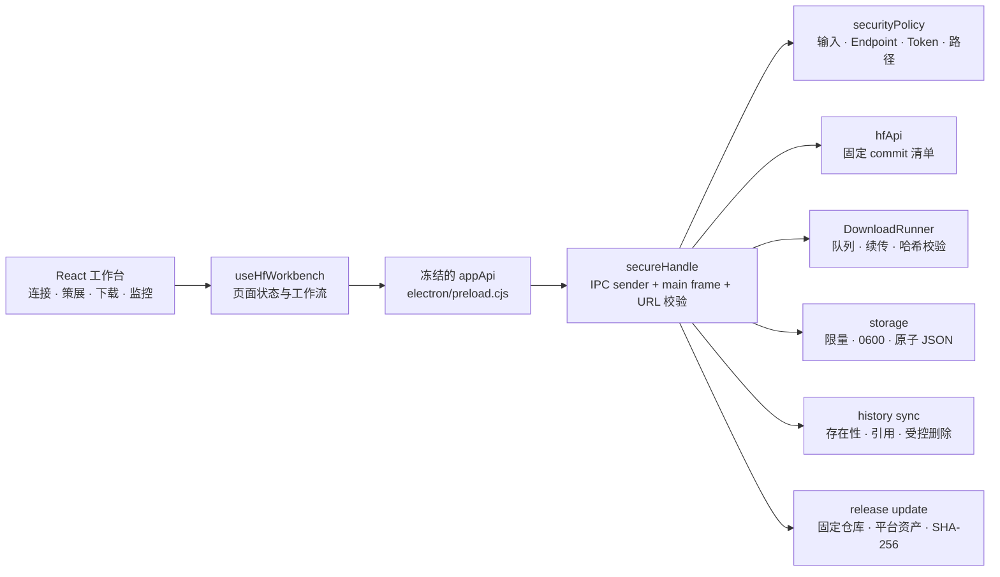
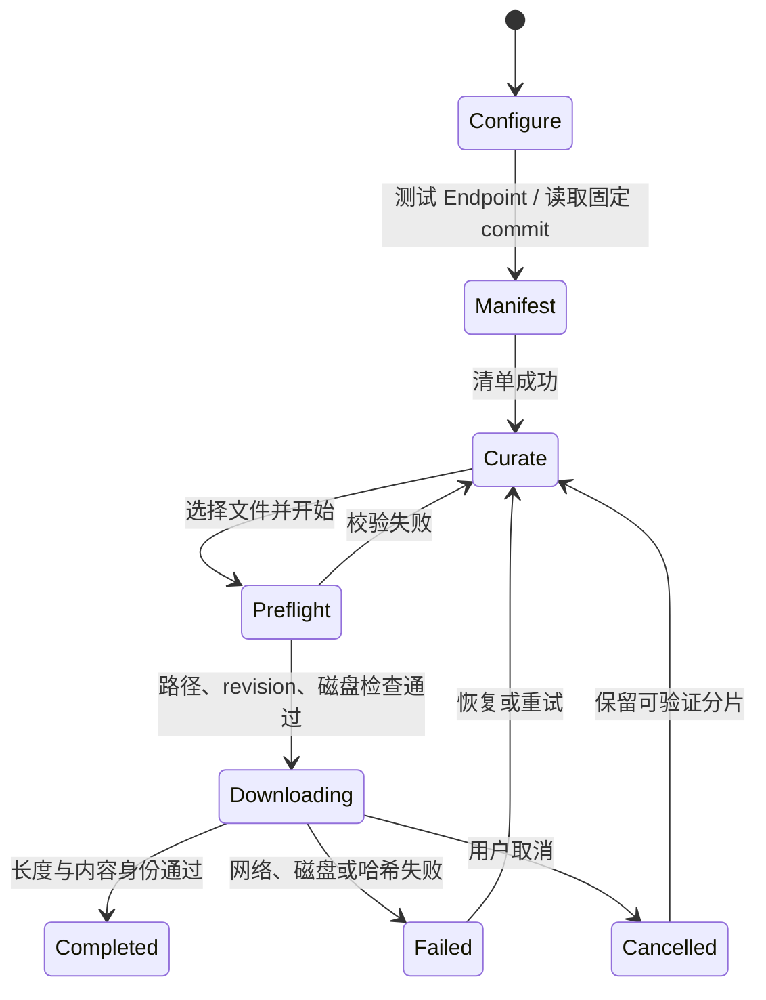
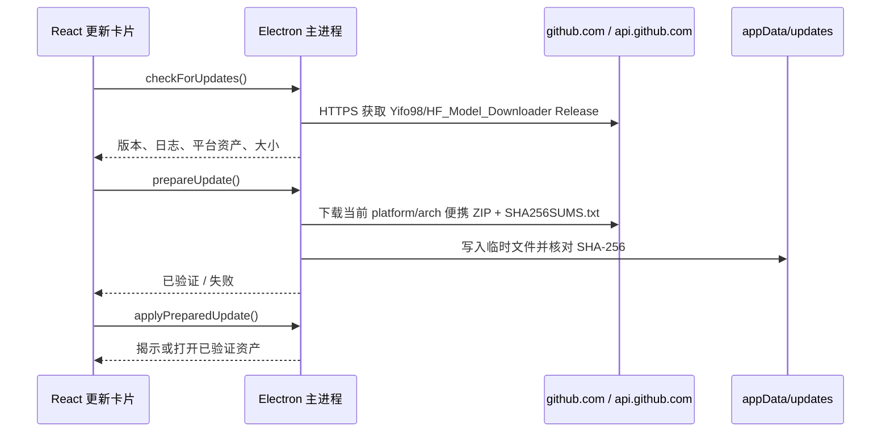

# 5.6 Sol 运行架构

## 目标

5.6 Sol 不再把界面、下载状态和桌面能力堆在单个组件或宽 IPC 面上。新结构把产品流程拆成可独立审查的界面模块，并把所有文件系统、网络和系统调用留在 Electron 主进程。

## 分层



### 渲染层

- `src/App.tsx`：只负责工作台编排和区域关系。
- `src/features/hf/hooks/useHfWorkbench.ts`：管理仓库、清单、选择、历史、下载和偏好状态。
- `SourceSetupPanel.tsx`：来源、Token、目录与连接状态。
- `SelectionWorkspace.tsx`：推荐方案、筛选和文件清单。
- `DownloadDock.tsx`：下载前摘要与主操作。
- `StatusPanel.tsx`：运行环境、队列、进度与日志。
- `HistoryPanel.tsx`：历史筛选、恢复与重试。

渲染层没有 Node.js、任意文件读写或任意命令执行能力。

### Preload 桥

`electron/preload.cjs` 只暴露冻结的业务 API。文件打开、文件定位、受控目录、历史同步/删除和更新检查分别使用专用 channel；不会把原始 `ipcRenderer` 暴露给页面。

### 主进程

`electron/main.ts` 负责：

- 单实例锁与主窗口生命周期
- `sandbox`、`contextIsolation`、导航、权限和 CSP
- IPC sender、主 frame 与可信 renderer URL 校验
- 用户批准下载目录的持久化与 realpath 解析
- Token、Endpoint、仓库 ID、下载请求的二次校验
- 下载前重新读取清单和磁盘空间预检
- 历史、偏好和运行目录管理
- 历史与受控下载根的本地文件核对，以及需要显式模式的删除动作
- 固定 GitHub Release 来源、平台资产选择、更新下载与 SHA-256 校验

### 下载核心

下载流程的不可变身份由以下字段共同决定：

```text
Endpoint + owner/repo + commit revision + file path
```

1. 先读取仓库元数据并取得 commit SHA。
2. 使用该 commit 读取 tree，清单项携带 revision 与可用内容哈希。
3. 下载 URL 固定到 commit，不使用可变的 `main`。
4. 输出目录使用 `owner/repo` 两级结构，避免不同所有者的同名仓库冲突。
5. 分片名称绑定完整下载身份，续传还要求强 ETag 匹配。
6. LFS 内容按 SHA-256 校验；普通 Git 文件按 blob OID 校验。
7. 没有可信哈希的既有文件不会仅凭大小被跳过。

## 状态流



## 数据落点

- macOS/Linux：`~/Program/HuggingFace/HF_Model_Downloader`
- 默认下载：`~/Program/Downloads`
- Windows portable：`PORTABLE_EXECUTABLE_DIR/HF_Model_Downloader_Data`

历史、偏好、缓存、session 和日志分开存放。旧数据迁移只读取历史与偏好白名单，并重写去除 Token 后的偏好；不会递归复制整套旧 Electron userData。

## 历史与本地文件同步

历史记录保存下载时的批准根、仓库身份和文件清单。刷新历史只在对应受控下载根中核对文件存在性：

1. 所有记录文件都不存在时，清理该历史记录。
2. 只有部分文件缺失时，保留记录并标记缺失数量，避免把不完整下载误报为完整。
3. “只删记录”不会触碰磁盘文件。
4. “记录与文件一起删除”必须由界面显式确认；主进程重新校验真实路径、根目录与其他历史引用后才逐项删除。
5. 只清理受控根内已为空的仓库目录，不递归删除未知内容。

## 便携更新流



当前发行没有平台签名，因此更新流不会伪装成静默自替换：应用只下载、校验并揭示当前平台的便携包，由用户退出旧版本后完成替换。

## 关键不变量

- Token 只允许发送到 `https://huggingface.co`。
- 正式包不接受 `VITE_DEV_SERVER_URL`；开发态也只允许 loopback。
- 远端 Endpoint 必须为 HTTPS；HTTP 只允许开发态 loopback。
- 正式打包版只允许官方源和内置 HF Mirror；任意自定义 Endpoint 仅在开发模式开放。
- renderer 不能指定任意系统路径或任意外链。
- 历史刷新与删除不能越出记录绑定的受控下载根；本地删除必须携带显式删除模式。
- 更新只接受 `Yifo98/HF_Model_Downloader` 的 HTTPS Release、当前平台/架构便携资产与同一 Release 的 `SHA256SUMS.txt`。
- 单次最多 10,000 个去重后的合法路径，并检测大小写不敏感文件系统冲突。
- 下载前要求已知文件大小，并保留 10% 加 512 MiB 的磁盘安全余量。
- 状态 JSON 有 8 MiB 上限，使用私有权限和原子替换。
